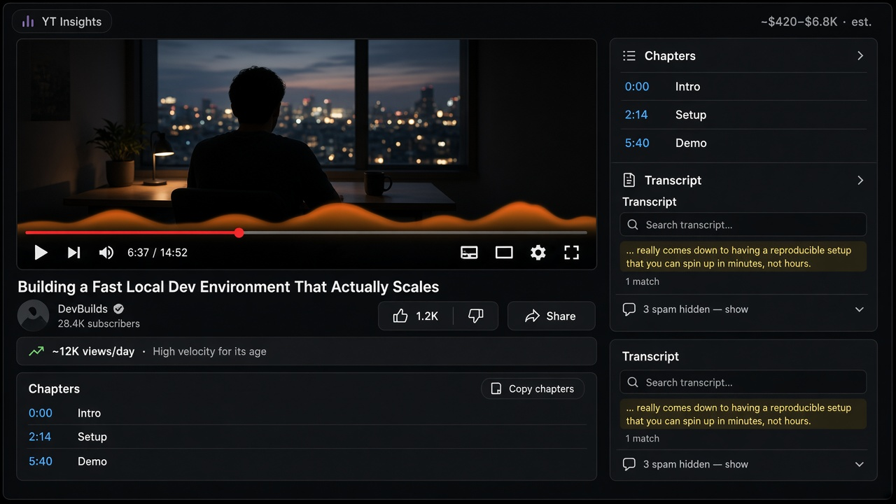

<div align="center">

# YT Insights

Estimated ad revenue, chapters, heatmap, and watch-page tools for YouTube.

[](manifest.json) [](manifest.json) [](manifest.json) [](manifest.json)
[](LICENSE)

</div>

**YT Insights** is a browser extension (Manifest V3) that adds watch-page insights on [youtube.com](https://www.youtube.com): estimated ad revenue above the likes, auto chapters, a most-replayed heatmap, spam soft-hide, a viral views/day strip, and transcript search.

No account, API key, local server, or build step is needed to use it. Revenue figures are **estimates only** — heuristic RPM bands computed in your browser, not official YouTube Analytics or Creator Studio payouts.

The extension uses Manifest V3 and plain JavaScript. Primary target is Chrome; the same package loads in other Chromium browsers and Firefox. It has no npm runtime, no background service worker in v1, and no ad blocking. It is designed to coexist with SponsorBlock and YouTube Premium.

<p align="center">
  
</p>

Mockup of the watch-page UI (revenue estimate, viral strip, chapters, heatmap, transcript search, spam soft-hide). Real screenshots welcome in PRs.

## Install

Download the latest `yt-insights-*.zip` from [Releases](https://github.com/SharpMeow/yt-insights/releases) (or [source ZIP](https://github.com/SharpMeow/yt-insights/archive/refs/heads/main.zip) / `git clone`), extract to a **permanent** folder, then load that folder in your browser. Keep the folder — browsers load unpacked extensions from disk.

### Chrome (primary)

1. Open `chrome://extensions`.
2. Enable **Developer mode**.
3. **Load unpacked** → select the folder that contains `manifest.json`.
4. Open a `youtube.com/watch?v=…` page and confirm the UI injects.

### Microsoft Edge

1. Open `edge://extensions`.
2. Enable **Developer mode**.
3. **Load unpacked** → same folder as above.

### Brave / Opera / Arc / other Chromium

Use that browser’s extensions page (`brave://extensions`, `opera://extensions`, etc.), enable Developer mode, and **Load unpacked** the same folder. Chromium browsers share the Manifest V3 package.

### Firefox

1. Open `about:debugging#/runtime/this-firefox`.
2. **Load Temporary Add-on…** → select `manifest.json` inside the extracted folder.
3. Temporary add-ons unload when Firefox restarts; reload the same way after a restart until a signed AMO build exists.

Safari is not supported in this release (different packaging).

### Updates

Replace the folder contents with the newer release (or `git pull`), click **Reload** on the extension card (Firefox: load temporary add-on again), and refresh YouTube tabs.

## How it works

| Feature | What happens |
| --- | --- |
| Estimated ad revenue | Aggregates client-side RPM models and shows a muted range on the `#actions` row above likes, right-aligned (`~$420–$6.8K · est.`), with a hover breakdown. Never injects into the title. Shorts use a lower RPM band when a safe actions anchor exists. |
| Chapters panel | Prefers native YouTube chapters, then description timestamps, then auto-split from captions (~8–15 sections). Click to seek; **Copy chapters** available. |
| Most-replayed heatmap | Uses native heat markers when present; otherwise synthesizes an estimated overlay from caption pacing density and labels it **est.** |
| Spam soft-hide | Pattern-matches promo/crypto/telegram bait, emoji dumps, near-duplicates, and suspicious names. Collapses matches; toggle *N spam hidden — show* restores them. |
| Viral views/day strip | Views per day since upload plus a short velocity blurb under description/info metadata — not in the title or actions row. |
| Transcript search | Searches caption cues; click a hit to seek. Shows *No transcript available* when captions are missing. |

**Not included:** ad blocking, sponsor skip UI, or SponsorBlock API usage.

## Coverage and limits

- **Host scope:** content scripts and host permission are limited to `https://www.youtube.com/*`.
- **Revenue:** heuristic RPM bands only. Real payouts depend on niche, geography, seasonality, Premium mix, and YouTube’s opaque systems. Always labeled **est.**
- **Heatmap:** when YouTube does not expose heat markers, the overlay is estimated from caption word density — not true most-replayed data.
- **Chapters (auto):** need captions/timedtext or description timestamps; otherwise the panel may not appear.
- **Transcript search:** requires available caption tracks; auto-generated captions vary in quality.
- **Spam filter:** pattern-based; expect false positives and negatives. Soft-hide is recoverable via the toggle.
- **DOM / SPA:** YouTube changes markup often. The extension re-injects on `yt-navigate-finish` and via MutationObserver, but selectors may need updates over time.
- **Shorts:** revenue chip may appear; full chapters/heatmap/spam UI targets classic `/watch` pages.

There is no official Analytics connection. The extension does not invent missing captions, does not claim payout accuracy, and does not fight SponsorBlock over ads or skips.

See [architecture notes](docs/ARCHITECTURE.md) and [threat model](docs/THREAT_MODEL.md).

## Privacy

Computation stays in the content script. No article or video bodies are uploaded to an AI service or developer backend. Caption fetches use YouTube timedtext URLs already referenced by the player. See [PRIVACY.md](PRIVACY.md) for permissions and data flows.

## Development

No Node or npm is required to load or ship the extension. Vanilla IIFE modules attach to a shared `YTI` namespace; `manifest.json` lists script order.

```sh
# Syntax check (optional)
for f in js/*.js; do node --check "$f"; done
# Pack zip
python3 scripts/pack.py
```

Load unpacked from this folder, reload the extension card after edits, then hard-refresh or SPA-navigate between YouTube videos. Test with SponsorBlock installed when possible.

Agent / LLM working notes: [AGENTS.md](AGENTS.md) and [docs/FOR_AGENTS.md](docs/FOR_AGENTS.md).

Bug reports and feature requests: use the [issue templates](https://github.com/SharpMeow/yt-insights/issues/new/choose).

See [CONTRIBUTING.md](CONTRIBUTING.md), [changelog](CHANGELOG.md), and [security policy](SECURITY.md).

## Credits and license

YT Insights is created by **Chaos** ([SharpMeow](https://github.com/SharpMeow)). Original code is [MIT licensed](LICENSE). YouTube, SponsorBlock, and related trademarks belong to their respective owners and are not affiliated with or endorsing this project.
